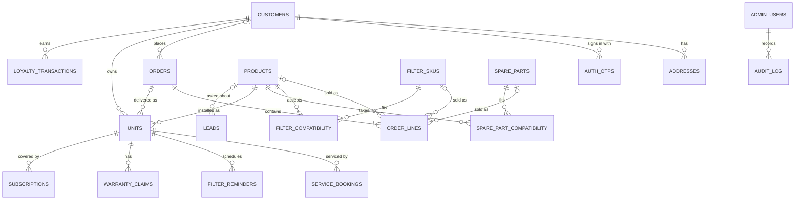
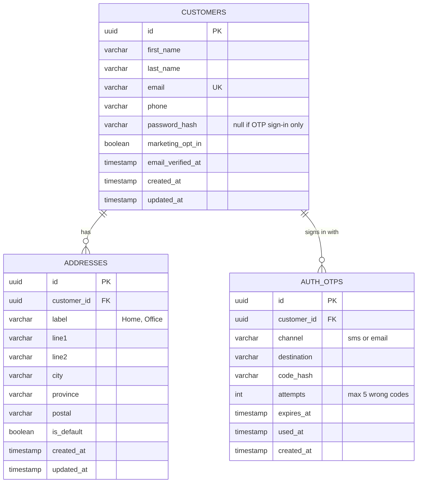
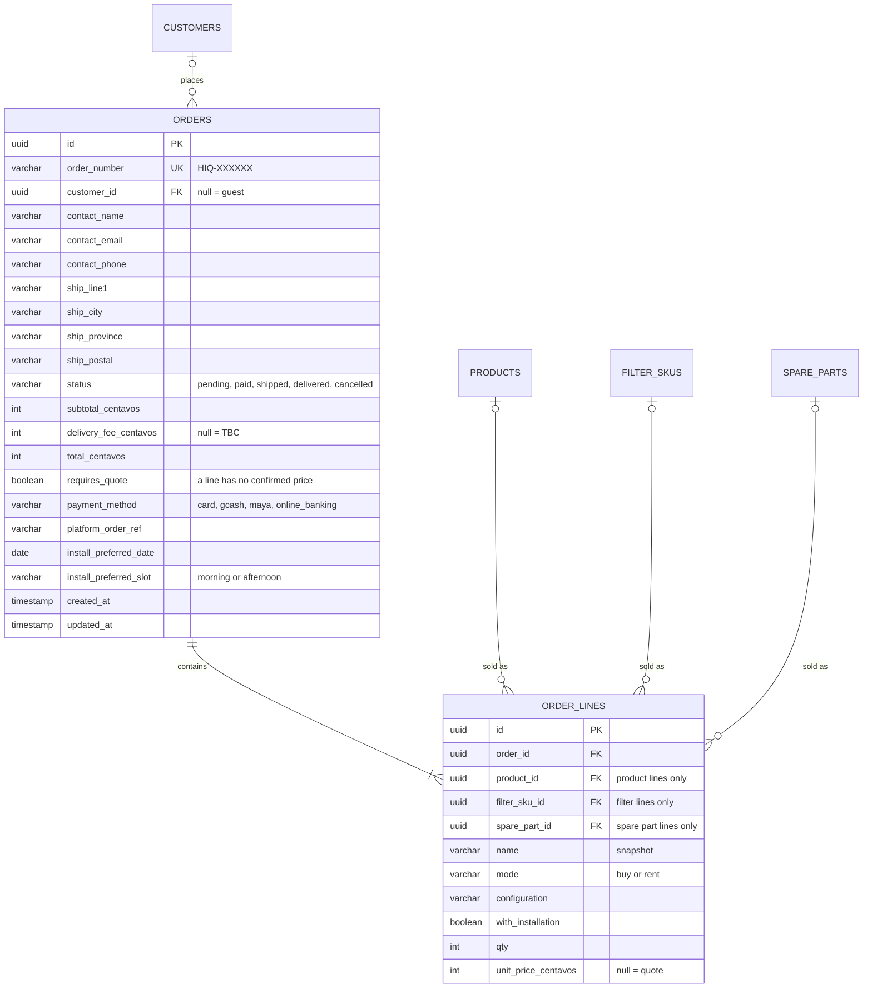
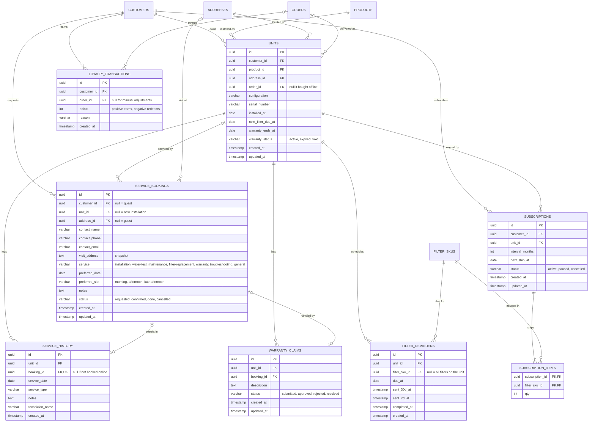
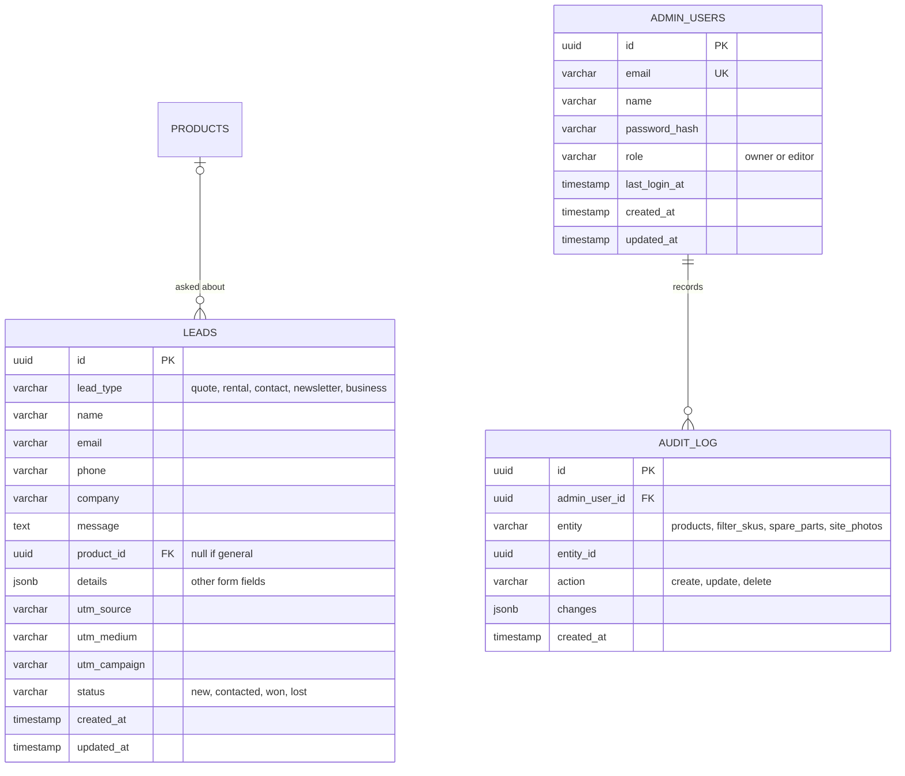

# Database design

Postgres schema used by the HIQ Shop API in `../server` (source of truth: `server/prisma/schema.prisma`). The front-end uses it when `VITE_API_URL` is set; otherwise it runs on mock data and browser storage. See [API.md](API.md) and [ADMIN.md](ADMIN.md).

Conventions: every table has `id uuid` as its primary key; money is `int` centavos (PHP); dates are ISO 8601; `null` in a price, interval or spec means **[TBC]**, as on the site. Card and payment details are never stored, they stay on the commerce platform.

## Overview

How the areas connect. Columns are in the detailed diagrams below.

## Customers and sign-in

`password_hash` matches the current register page; `AUTH_OTPS` supports the one-time-code sign-in planned in API.md. Keep one or both.

## Catalogue

Needs, filtration types and configurations are lookup tables so the shop filters and the Find My System quiz can join on them. `slug` never changes once created.

Two kinds of thing are sold besides systems:
- **Replacement filters** (`filter_skus`) are made for specific HIQ models and drive filter reminders and subscriptions.
- **Spare parts** (`spare_parts`) are fittings, tubing, faucets, valves, housings and general-purpose cartridges. Each size is its own row with its own SKU. A part with no rows in `spare_part_compatibility` fits any system of that size. `unit` says what the price and quantity count: a piece, a meter of tubing or a pack.

```mermaid
erDiagram
    PRODUCTS ||--o{ PRODUCT_IMAGES : shows
    PRODUCTS ||--o{ PRODUCT_SPECS : "described by"
    PRODUCTS ||--o{ PRODUCT_NEEDS : suits
    NEEDS ||--o{ PRODUCT_NEEDS : "applies to"
    PRODUCTS ||--o{ PRODUCT_FILTRATIONS : uses
    FILTRATION_TYPES ||--o{ PRODUCT_FILTRATIONS : "used by"
    PRODUCTS ||--o{ PRODUCT_CONFIGURATIONS : "offered as"
    CONFIGURATIONS ||--o{ PRODUCT_CONFIGURATIONS : "available on"
    PRODUCTS ||--o{ FILTER_COMPATIBILITY : accepts
    FILTER_SKUS ||--o{ FILTER_COMPATIBILITY : fits
    PRODUCTS ||--o{ SPARE_PART_COMPATIBILITY : takes
    SPARE_PARTS ||--o{ SPARE_PART_COMPATIBILITY : fits

    PRODUCTS {
        uuid id PK
        varchar slug UK "never changes"
        varchar model
        varchar category "under-sink, countertop, dispensers, whole-house, commercial, industrial, emergency"
        varchar channel "shop or quote"
        boolean hot_cold
        varchar install
        int tds_limit
        boolean is_entry
        boolean is_bottleless
        boolean is_table_top
        boolean is_office
        text summary
        jsonb highlights
        int price_centavos "null = TBC"
        int warranty_months "null = TBC"
        boolean warranty_tbc "shows the WARRANTY TBC tag"
        varchar store_url
        int featured_rank
        boolean is_hidden
        timestamp created_at
        timestamp updated_at
    }
    PRODUCT_IMAGES {
        uuid id PK
        uuid product_id FK
        varchar src
        varchar alt
        int sort_order "0 = main photo"
        timestamp created_at
    }
    PRODUCT_SPECS {
        uuid id PK
        uuid product_id FK
        varchar spec_key "unique per product"
        varchar spec_value "null = TBC"
        int sort_order
    }
    NEEDS {
        uuid id PK
        varchar code UK "home, condo, office, business"
        varchar label
    }
    PRODUCT_NEEDS {
        uuid product_id PK, FK
        uuid need_id PK, FK
    }
    FILTRATION_TYPES {
        uuid id PK
        varchar code UK "UF, Nano, RO, UV, Alkaline"
        varchar label
    }
    PRODUCT_FILTRATIONS {
        uuid product_id PK, FK
        uuid filtration_type_id PK, FK
    }
    CONFIGURATIONS {
        uuid id PK
        varchar name UK "Hot and Cold"
    }
    PRODUCT_CONFIGURATIONS {
        uuid product_id PK, FK
        uuid configuration_id PK, FK
        int sort_order
    }
    FILTER_SKUS {
        uuid id PK
        varchar sku "make unique once SKUs are confirmed"
        varchar name
        varchar stage
        int interval_months "null = TBC"
        int price_centavos "null = TBC"
        text note
        int sort_order
        timestamp created_at
        timestamp updated_at
    }
    FILTER_COMPATIBILITY {
        uuid filter_sku_id PK, FK
        uuid product_id PK, FK
    }
    SPARE_PARTS {
        uuid id PK
        varchar slug UK "never changes"
        varchar sku "[PART SKU TBC] until confirmed"
        varchar name "includes the size"
        varchar category "fittings, hoses-tubing, filter-cartridges, faucets, valves, housings, other"
        text description
        json specs "label to value, null = TBC; json keeps the label order"
        jsonb images "[{ src, alt }], first = main photo"
        varchar unit "piece, meter or pack"
        int price_centavos "per unit, null = TBC"
        boolean is_hidden
        int sort_order
        timestamp created_at
        timestamp updated_at
    }
    SPARE_PART_COMPATIBILITY {
        uuid spare_part_id PK, FK
        uuid product_id PK, FK
    }
    SITE_PHOTOS {
        uuid id PK
        varchar photo_key UK
        varchar src
        varchar alt
        timestamp updated_at
    }
```

## Orders

Guests can check out, so `customer_id` is optional and the contact and delivery details are copied onto the order. Each line is exactly one of: a product, a replacement filter or a spare part. Products and filters go up to 20 per line; spare parts up to 500, for tubing by the meter and reseller packs.

## After-sales: units, service, filters

A unit is one installed system. It drives the account area: filter due dates, reminders, service history and warranty.

Subscriptions and loyalty are optional until HIQ confirms the offers ([CONFIRM SUBSCRIPTION OFFER], [CONFIRM PROGRAMME]).

## Sales and admin

